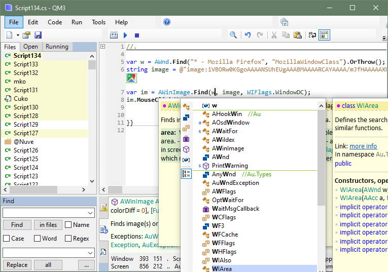

# Au editor

Au editor is an integrated scripting environment (ISE) for creating and executing automation scripts using the Au automation library which is installed together.

In the main window: code editor, several panels, toolbars and menu bar. Also there is a tray icon. The main window can be hidden, it depends on program settings.

### Code editor
Here you edit automation scripts and other text files.
[Features](xref:code_editor).

Multiple files can be open, but only one is visible. The list of open files is in the Open panel.

All changes are saved automatically after some time and also when closing etc. The Save button saves all changes immediately.

### Panels
Panels and bars can be docked, floating or hidden.

#### Files
All files and folders of current workspace.

Click an item to open in the code editor. Right-click to show File menu. Middle-click to close. Drag and drop to reorder or add new files.

All changes are saved automatically.

C# code files have .cs extension but it is hidden. Yellow background if the file is open in the code editor.

Deleted files and folders are moved to the Recycle Bin if possible. To restore a file or folder, find it there and restore; then find in File Explorer and drag and drop to the Files panel.

File properties are documented in the Properties dialog.

Files are of these types:
- Script - C# code file that can be executed directly, like a program.
- Class - C# code file that cannot be executed directly but contains code used by other files.
- Text files - txt, xml and other files that can be edited in the code editor.
- Other files - files that cannot be edited. Images etc. For example can be added to assembly resources.

Folders are of these types:
- simple folders.
- folders named like <i>@Project</i> are [project](xref:class_project) folders.

The collection of files and folders is a *workspace*. It is a folder on disk. In the folder:
- the **files** folder contains all files and folders of the workspace.
- the **files.xml** file is the list of files and folders of the workspace.
- the **settings.json** file contains workspace settings.
- the **state.db** file contains code editor states for files, such as folding, markers and current position.
- the **.xxx** folders are temporary cache folders used by the program.

#### Open
List of files open in the code editor.

Click a file to activate in the code editor. Middle-click to close.

#### Running
Running scripts. The color depends on the runSingle property: blue if false, green if true.

Right-click an item to end the process. Click to open and activate in the code editor.

#### Find
Find and replace text in the code editor. Find files and text in files.

Middle-click to clear edit field text.

#### Found
Results of "Find in text". Displays files and text lines containing the text. With links to found text instances and to replace all found in a file. 

#### Output
The program writes various info here. For example script compilation errors. Scripts use [AOutput.Write]() for it.

Right-click to show context menu. Middle-click to clear.

#### Info
Quick info about object from mouse. In code editor - function, class etc. In other windows - mouse x y, window name/class/program, control id/class, menu item id.

### Menus
Currently many menu commands are not implemented. These menu items have white invisible text.

#### File
File and workspace management commands.

#### Edit
Code editing commands.

#### Code
Code creation tools.

#### Run
Commands to execute current script.

#### Tools
Various tool windows.

#### Help
Program help and library reference.

### Tray icon
Shows program status.

Click to show and activate editor window. Right-click to show context menu. Middle-click to disable/enable triggers.

Colors:
- blue - default.
- green - a script task is running. Only if its runSingle property is true.
- gray - triggers are disabled.
