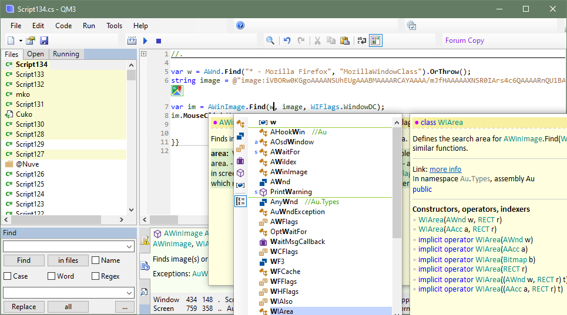

# Au automation library and editor

This code consists of two parts that can be used together or separately:
- Au library is a .NET library for automation of various tasks on Windows computers. Send keys to windows, find/click UI objects, execute programs, process text, use hotkeys, autotext.
- Au editor program is an integrated scripting environment for creating and executing automation scripts using the Au library and C#. And creating .NET programs and libraries for any purpose. Like a mini Visual Studio.

More info and download the setup program: https://www.quickmacros.com/au/help/

